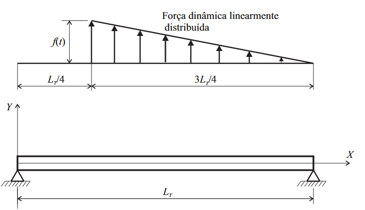
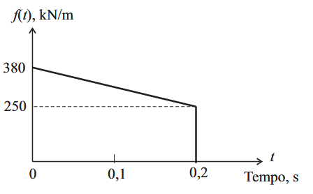
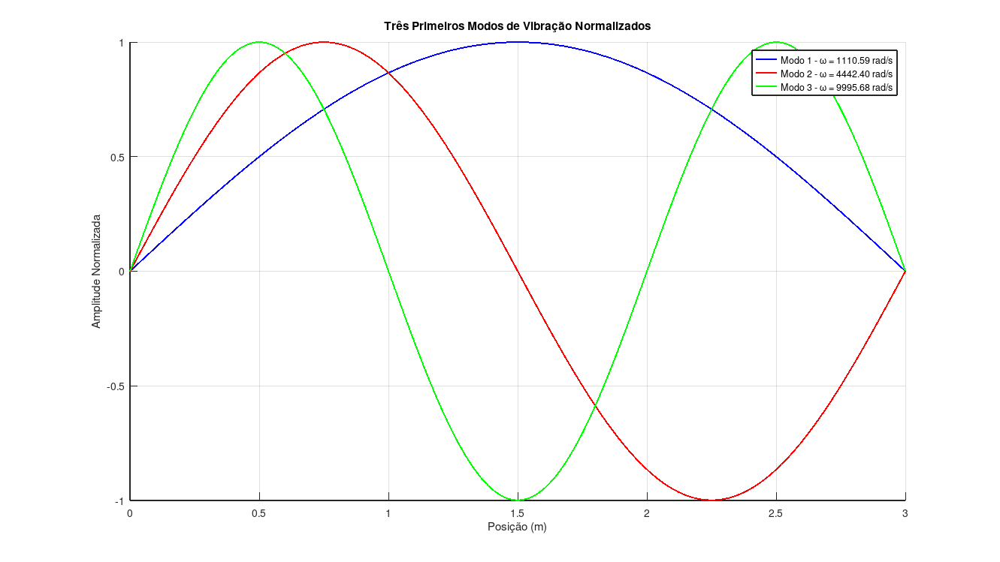
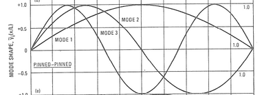

# Trabalho de Implementação Computacional 1; Análise de vigas

Utilizando matlab foi desenvolvido um script para calcular os deslocamentos em uma viga que possui dois apoios fixos em suas extremidades, sujeito a uma carga distribuida ao longo do tempo como na imagem a seguir.



Onde temos como parametros da viga $L_T = 3 m$, $E = 200 GPa$, $I = 8 * 10^{(-4)} m^4$, $A = 2 * 10^{(-2)} m^2$ e
$\rho = 7800 kg/m^3$.

A carga aplicada segue a seguinte função de tempo:

$$ f(t) = 380*10^3 + \frac{(250 - 380)*10^3}{0.2}t \text{, } 0 \leq t \leq 0.2 $$

Graficamente representada por:



## 1. Frequência de vibração e modos naturais

Para obtermos os modos naturais e a frequência de vibração, foi analisado o problema utilizando 20 elementos finitos, onde obtemos as 3 primeiras frequências naturais $f_{1} = 176.76 Hz$, $f_{2} = 707.03 Hz$, $f_{3} = 1590.9 Hz$, onde temos os seguintes modos naturais:




Compatível com os resultados obtidos analiticamente, encontrados em https://drive.google.com/file/d/1fGZMohnHWR0wFWQoe1oclCmgyOpEaXYL/view, onde temos os seguintes modos naturais:


## 2. Resposta da viga ao longo do tempo

<!-- Calcule a resposta da viga por um tempo de simulação, considerando que a viga inicialmente
está em repouso e sem deformação. Defina previamente o passo de tempo h justificando sua
escolha.
Apresente graficamente as histórias no tempo tanto do deslocamento quanto da rotação para
dois nós escolhidos arbitrariamente. -->

Para escolher o passo de tempo, pegamos como base a frequência mais proxima da frequência de corte escolhida arbitrariamente, que no caso foi de 
2000 Hz
## 3. Demonstração da deformação ao longo do tempo


## 5. Codigo computacional implementado

Segue abaixo o codigo implementado em matlab.
A priori o codigo define os valores das constantes, como o modulo de elasticidade, a area da seção transversal, os angulos e os comprimentos iniciais das barras.

Em seguida é especifico a matriz de equivalencia, que relaciona os nós da treliça com as barras.

O codigo então calcula a matriz de rigidez de cada barra e a soma na matriz de rigidez global.

Em seguida são definidas as condições de contorno, onde são aplicadas as forças e os deslocamentos conhecidos.

A matriz de rigidez global é reduzida para os graus de liberdade desconhecidos e os deslocamentos são calculados.

Por fim, são calculadas as tensões de cada barra.

Codigo também disponivel em:

<https://github.com/freedxmgxd/metodos-computacionais-para-analise-estrutural/blob/main/Trabalho_1/main.m>

```matlab
clear all
close all
clc

E = 200e9;
A = 0.0127; 

beta=[45 90 135 116.56505 0 135 45 90 90 0 0]*pi/180;
L = [sqrt(2) 3 sqrt(2) sqrt(5) 1 sqrt(2) sqrt(2) 1 1 1 2];

K = zeros(14,14);

% Matrix de equivalencia

ME = [11 12 9 10
    11 12 1 2
    13 14 1 2
    9 10 1 2
    13 14 7 8
    7 8 3 4
    7 8 5 6
    9 10 13 14
    13 14 3 4
    1 2 3 4
    3 4 5 6];

for n=1:11
    k = A*E/L(n);
    c = cos(beta(n));
    s = sin(beta(n));
    ke= k * [c*c c*s -c*c -c*s
        c*s s*s -c*s -s*s
        -c*c -c*s c*c c*s
        -c*s -s*s c*s s*s];
    disp(ke);
    for i=1:4
        for j=1:4
            c=ke(i,j);
            I=ME(n,i);
            J=ME(n,j);
            K(I,J) = K(I,J) + c;
        end
    end
end

disp(K);

% Condições de contorno

% Forças
R = zeros(14,1);
R(6) = -200000;

% D1 = D2 = D11 = 0
D0 = [1 2 11];

K_reduzido = K;
R_reduzido = R;

K_reduzido(D0,:) = [];
K_reduzido(:,D0) = [];
R_reduzido(D0,:) = [];

D_reduzido = inv(K_reduzido)*R_reduzido;

% Reinserindo os valores de D

D = zeros(14,1);
indices_restantes = setdiff(1:14, D0);
D(indices_restantes) = D_reduzido;

disp(D);

tensoes = zeros(11,1);

for i= 1:11
  ui = D(ME(i,1));
  vi = D(ME(i,2));
  uj = D(ME(i,3));
  vj = D(ME(i,4));
  c = cos(beta(i));
  s = sin(beta(i));
  
  deformation = (uj - ui)*c + (vj - vi)*s;
  tensoes(i) = (E/L(i))*deformation;
end

disp(tensoes);


% Coordenadas dos nós
x = [0, 1, 3,  2,  1,  0,  1];
y = [0, 0, 0, -1, -2, -3, -1];

% Deslocamentos nodais
Ux = D(1:2:end);
Uy = D(2:2:end);

% Coordenadas dos nós deformados
fator_escala = 10; % Exagera a deformação
x_deformado = x + fator_escala * Ux';
y_deformado = y + fator_escala * Uy';

% Conectividade das barras
barras = [1 2; 1 7; 1 5; 1 6; 2 3; 2 4; 2 7; 3 4; 4 7; 5 6; 5 7;]

% Plot da treliça na mesma figura
figure;

% Plot da configuração inicial
for i = 1:size(barras, 1)
  no1 = barras(i, 1);
  no2 = barras(i, 2);
  h_inicial = plot([x(no1), x(no2)], [y(no1), y(no2)], 'b-'); % Linhas azuis para a configuração inicial
  hold on;
end
h_inicial_nos = plot(x, y, 'bo', 'MarkerFaceColor', 'b'); % Nós azuis

% Plot da configuração deformada
for i = 1:size(barras, 1)
  no1 = barras(i, 1);
  no2 = barras(i, 2);
  h_deformada = plot([x_deformado(no1), x_deformado(no2)], [y_deformado(no1), y_deformado(no2)], 'r--'); % Linhas vermelhas tracejadas para a configuração deformada
end
h_deformada_nos = plot(x_deformado, y_deformado, 'ro', 'MarkerFaceColor', 'r'); % Nós vermelhos

title('Treliça - Configuração Inicial e Deformada');
axis equal;
legend([h_inicial, h_deformada], 'Inicial', 'Deformada');
```
